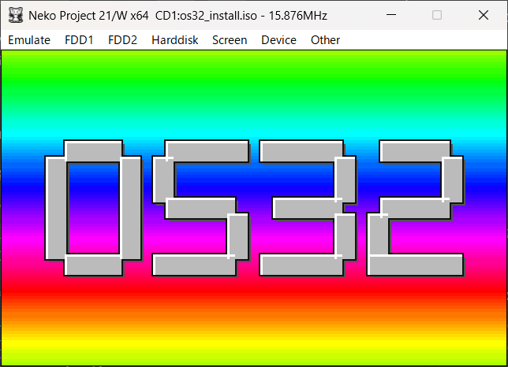
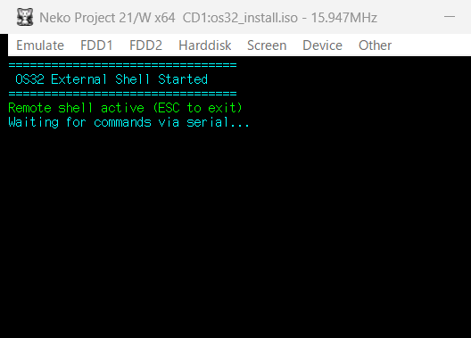

# OS32 v3 — PC-9801 / 9821 32ビット ベアメタルOS (現行の開発リポジトリ)




**OS32** は、NEC PC-9801 / 9821 シリーズ向けに開発している、32 ビットプロテクトモードで動作するベアメタル OS です。
このリポジトリ **os32-v3** が現行の開発 (v3) です。v3 の目的は
*「PC-9821 の実機で、1 本のアプリケーションに機械の資源を渡し切れる入れ物を作り直す。入れ物とは、カーネル帯の切り方 (再配置)、
ドライバの置き場 (動的読み込み)、装置窓の資源割当、実機の装置ドライバ、そしてその上の HAL の口である。時代依存の仕事は Host Service に任せ、
OS32 側の契約は小さく保つ」* ([docs/tasks/v3/V3_PLAN_DRAFT.md §2](docs/tasks/v3/V3_PLAN_DRAFT.md))。機能を足す前に入れ物を作り直す版で、
最初の票は C89 → C11 の移行 ([docs/tasks/v3/TASK_C11_MIGRATION.md](docs/tasks/v3/TASK_C11_MIGRATION.md))、
設計の決定は [docs/tasks/v3/TASK_MEMMAP_V3.md](docs/tasks/v3/TASK_MEMMAP_V3.md) にあります。

**fork 元**: os32 v2.1 (リポジトリ [os32](https://github.com/ske-studio/os32)、タグ `v2.1` = コミット `6ccc4049`) と、fork 時点の `feat/gui` (`dfa97f57`、2026-09-30) の作業ツリーです。
os32-v3 は新しい履歴 (初期コミット 1 つ) で始めていて、**v2.x までのコミット履歴・日次の記録は os32 にあります**。
開発の経緯と版の推移は [docs/HISTORY.md](docs/HISTORY.md)、得た教訓は [docs/CASE_STUDIES.md](docs/CASE_STUDIES.md)、
fork の段取りは [docs/tasks/v3/FORK_PLAN.md](docs/tasks/v3/FORK_PLAN.md)。os32 (v2.x、`main`) は戻り先で、新機能は入れず、文書の正典もこのリポジトリに移しました (os32 側の docs は更新しません)。

**submodule `apps/` `game/` は private です**。標準アプリと盤上ゲーム RPG は別リポジトリ (`ske-studio/os32-apps`、`ske-studio/os32-game`) で、
公開していません。clone は `--recurse-submodules` を**付けずに**行ってください — apps / game が無くてもカーネル・シェル・コマンド・SDK・ディスクイメージ
(core) はすべて組めます (`make all`)。アクセス権のあるトークンがあれば `git submodule update --init` の後に `make external` で apps / game も組めます。

NP21/W エミュレータと実機で動作します (実機は PC-9821Ra266 で FD 起動・CD からの HDD インストール・HDD 起動を確認 —
[v2.1 のリリースノート](docs/RELEASE_v2.1.md))。以下の機能一覧と数字は fork 時点 (v2.1) のもので、v3 の作業で順に更新します。

最低動作環境の数値は未確定です。設計上の下限は **物理 9.6MB 構成以上**
(CPL=3 アプリのスタックが 0x7C0000〜0x7FFFFF に固定のため)。GUI の必要 RAM は
実測で別途定義し、開発を特定の容量に制限しません。設計対象と現在の実装上限は
[メモリ方針](docs/02_memory.md)を参照してください (v3 のメモリマップは上記 TASK_MEMMAP_V3 で切り直します)。

## 制作経緯
昨今AIでのバイブコーディングの波にRide On!しており、昔高校生の頃に遊んでいた「PC98のプログラムとかバリバリかけるんじゃね？」という思いつきで開発を始めました。
最初はDOSで動くプログラムを作って遊び始めましたが、（グラフィックライブラリとか作らせて）だんだんDOSの制約を思い出してきて「面倒くせえ」となり、もっと面倒な思考に陥って「これ、386で動く32bitOSならだいたい解決じゃね？」みたいなとんでもない境地に至りました。
そして、当時より豊富な経験と知識？と先人たちの叡智を集めAIに奴隷労働をさせてとりあえず動く？32bitOSが完成しました。
なにぶんテストもろくに終えてないのでバグだらけですが、何処かの奇特な御仁が実機でテストなどしていただけることを夢見ております。
2026-04 の初期コミットから v2.1 までの半年の経緯は [docs/HISTORY.md](docs/HISTORY.md) にまとめてあります。

## 主な機能 (fork 時点、v2.1)

### カーネル

- **i386 プロテクトモード** (フラットモデル + ページング)
- **IDT/PIC** 完全制御 (IRQ再マッピング, ISR ハンドラ)
- **ページング** + ガードページ による安全なメモリ管理
- **kmalloc** カーネルメモリアロケータ
- **KernelAPI v68** — 関数表 (容量 300、うち 240 実装) + 固定オフセットのデータ欄による外部プログラムインタフェース
- プログラム終了時の**リソース自動回収** (FD, リダイレクト, パイプ, 共有メモリ)

### ファイルシステム

- **VFS** (仮想ファイルシステム) 基盤
- **ext2** 読み書き対応
- **FAT12** 読み込み対応 (フロッピーディスク)
- **ISO 9660** 読み込み対応 (CD-ROM)
- パイプ・リダイレクト (`|`, `>`, `>>`, `<`, `2>`)

### デバイスドライバ

| ドライバ | 対象ハードウェア |
|---------|----------------|
| KBD | uPD8251A キーボード (IRQ1) |
| IDE | IDE HDD (NHD イメージ) |
| ATAPI | ATAPI CD-ROM ドライブ |
| FDC | uPD765A フロッピーディスク (fd0) |
| Serial | uPD8251A RS-232C (IRQ4) |
| FM | YM2203 (OPN) FM3+SSG3 |
| RTC | uPD4990A リアルタイムクロック |
| KCG | JIS第1/2水準漢字ROM |

### シェル

- **外部プログラム方式** の高機能シェル
- Tab補完、コマンド履歴、環境変数、`$VAR` 展開、`~` 展開
- ワイルドカード (`*.txt`)、引用符 (`"..."`, `'...'`)
- **スクリプトエンジン** (`source`/`if`/`goto`/`return`/`ask` によるバッチ実行)
- `/etc/profile` による起動時自動設定

### コマンド一覧

#### ファイル操作
`ls` `cat` `cp` `mv` `rm` `mkdir` `rmdir` `touch` `head` `tail` `more` `grep` `wc` `tee` `hexdump` `find` `sort` `diff` `du`

#### システム
`ver` `date` `uptime` `tick` `time` `sleep` `cal` `mem` `env` `echo` `beep` `clear` `reboot` `np2`

#### ストレージ
`mount` `umount` `sync` `format` `ide` `dev`

#### ネットワーク・転送
`send` `recv` `serial` `upload` `rshell`

#### エディタ・ビューア
`edit` (VZ Editor インスパイア) `man` `mdview` (Markdown ビューア)

#### グラフィックス
`gfx_demo` `vbzview` `vdpview` `spr_test` `raster` `ekakiuta` `demo1`

#### サウンド
`sndctl` `play`

### GUI シェル (1.1〜1.4、GUI の版は 1.4 で閉じた)

- **gshell** — Win3.1 風の協調型 GUI デスクトップ (WM はシェル帯に常駐)。`os32gui` で CUI と往復
- **libos32gui** 共有ライブラリ (0x400000、ジャンプ表) — 窓 / イベント / ウィジェット木 / 箱レイアウト
- WM 側 FEP (SHIFT+SPACE)、14 色リース、モーダル、CTRL+STOP でアプリを畳む
- マウスなしの操作 (Win98 準拠: CTRL+ESC、GRPH+TAB、GRPH+SPACE の窓メニュー、カナでマウスキー)。一覧は `man os32gui`
- 9821 対応: **PEGC 640×480×256 色**、**Cirrus GD5430 (Xe10)** の HW 塗り / BLT (バックエンド表で切替)
- v3 では GUI に版を付けず、入れ物 (メモリマップ・ドライバの置き場) の作り直しの上で続ける ([docs/ROADMAP.md §0](docs/ROADMAP.md))

### グラフィックス

- **640×400 16色** CPU直接描画 (9801。EGC/GRCG は使わない)、9821 は上記の PEGC / Cirrus バックエンド
- `libos32gfx` ユーザーライブラリ (点・直線・矩形・円・テキスト描画)
- ダーティレクタングル管理による効率的なVRAM転送
- サーフェス・スプライト・VBZベクタ形式対応
- ラスタパレットアニメーション

### 実機 (PC-9821Ra266、v2.1)

- FD 起動 (2HD 1232KB / 1.44MB)、CD からの HDD インストール (`cdinst`)、HDD 起動、シリアル 115200 と SerialFS (HDD 起動のまま更新)、PCI 列挙
- v3 で続ける実機の票 (内蔵 82557 LAN、PCM、Trident、PEGC 480 の目視) は [docs/tasks/realhw/PLAN.md](docs/tasks/realhw/PLAN.md)

## クイックスタート

[INSTALL.md](INSTALL.md) を参照してください。

## ディレクトリ構成

```text
os32-v3/
├── boot/       — ブートローダー (16bit/32bit ASM + C)
├── kernel/     — カーネルコア (IDT/PIC/ページング/kmalloc/コンソール)
├── drivers/    — デバイスドライバ (KBD/IDE/FDC/Serial/FM/RTC/KCG/Mouse/NP2SysP)
├── gfx/        — グラフィックス (CPU直接描画)
├── fs/         — ファイルシステム (VFS/ext2/FAT12/FatFs/ISO9660/HostDrv)
├── exec/       — プログラムローダー (OS32X)
├── kapi/       — KernelAPIラッパー (自動生成)
├── lib/        — ユーティリティ (UTF-8/パス/LZ4/SQLite)
├── include/    — 共通ヘッダ
├── userland/   — ユーザー空間 (シェル/コマンド/ライブラリ/Rust)
├── apps/       — 標準アプリ (private submodule。SDK だけでビルドする独立ツリー)
├── game/       — ゲーム (private submodule。同上)
├── sdk/        — 配布 SDK (ヘッダ/crt/リンカスクリプト/サンプル)
├── build/      — モジュール化 Makefile 群・リンカスクリプト
├── tools/      — ビルドツール・スクリプト
└── docs/       — 仕様書・開発ドキュメント (docs/hw/ は著作権物のミラーで git に入れない)
```

## ドキュメント

- [ドキュメント索引](docs/INDEX.md) — 冒頭の「情報単位ごとの正典」表が更新先を決める
- [KernelAPI 仕様書](docs/KAPI_SPEC.md)
- [開発ガイドライン](docs/DEVELOPMENT.md)
- [開発ポリシー](docs/POLICY_DEV.md) / [デバッグポリシー](docs/POLICY_DEBUG.md)
- [リリースロードマップ](docs/ROADMAP.md)
- [開発の経緯](docs/HISTORY.md) / [ケーススタディ](docs/CASE_STUDIES.md)

## ビルド

```bash
make all           # カーネル + 全プログラム + SDK + D88イメージ + ISO (apps/game が無くても組める)
make external      # apps/ + game/ (submodule を取得できた場合だけ)
make check-fast    # ホスト試験と文書・生成物の検査 (変異なし)
make clean         # クリーン
make deploy        # HostDrv (C:\os32) へのデプロイ (再起動不要)
make deploy-kernel # NHDイメージへのデプロイ (要NP21/W再起動)
```

必要なツールチェイン: `i386-elf-gcc` (13.2.0 + newlib-nano), `nasm`, `make`, `python3` (+lz4), `rustup`
(構築手順は [docs/08_build.md](docs/08_build.md) §8-5、CI 用のスクリプトは `tools/ci/build_cross.sh`)。
日本語フォント (IPAex) はリポジトリに無く、初回の `make all` (または `make fonts`) が IPA の公式配布から取得します —
IPA Font License v1.0 への同意を聞きます (非対話は `OS32_ACCEPT_IPA_LICENSE=1`、[docs/08_build.md](docs/08_build.md) §8-1)。
CI (GitHub Actions) は os32 のものを持ってこず、このリポジトリで作り直します ([docs/tasks/v3/FORK_PLAN.md §3 d](docs/tasks/v3/FORK_PLAN.md))。

## ライセンス

[MIT License](LICENSE)。取り込んでいる第三者の部品 (SQLite、zlib、FatFs、IPADIC、IPAex フォントなど) と
その配布条件は [THIRD_PARTY.md](THIRD_PARTY.md)。ホストの Python 依存は [requirements.txt](requirements.txt)。

Copyright (c) 2025-2026 すけさん
